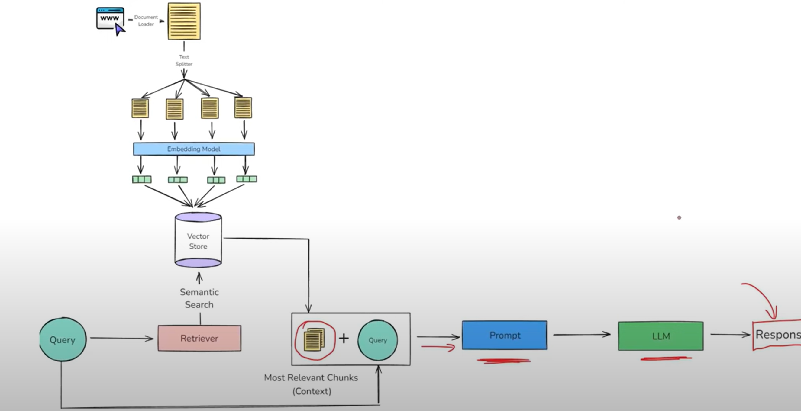

### 📺 YouTube Transcript QA Bot

A simple Question Answering (QA) web app that allows users to ask questions about a YouTube video by leveraging its transcript. This app uses Retrieval-Augmented Generation (RAG) with Google Gemini as the LLM, powered by LangChain for orchestration and Streamlit for the web interface.

---

### 🛠️ Tech Stack
Google Gemini – Large Language Model (LLM)

LangChain – Framework for building RAG pipelines

Streamlit – Frontend for interaction

YouTube Video ID – To fetch video subtitles

---

### 🧠 How It Works

- 1. The user enters a YouTube video id
- 2. The transcript is fetched using - YouTubeTranscriptApi
- 3. Text Splitting - RecursiveCharactertextSplitter is used to split the transcript into small chunks 
- 4. Embeddings are generated using HuggingFace Embedding Model and Then it stored int FAISS vector store.
- 5. When user asks a question , the relevant context is fed along with query to the LLM Model.

---

### Complete WorkFlow

